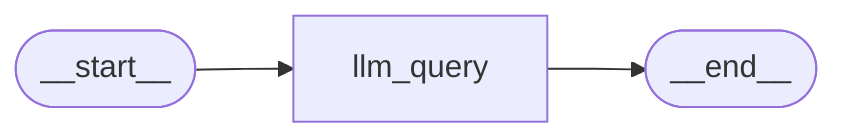

# langgraph-qa-starter

A minimal [LangGraph](https://langchain-ai.github.io/langgraph/) example that wires a single LLM node into a graph. You pass in a question, the graph sends it to OpenAI's `gpt-4o-mini`, and you get the answer back in the graph state.

It's a good "hello world" for learning how `StateGraph`, nodes, edges, and `compile()` / `invoke()` fit together.

## How it works

The graph has one node, `llm_query`, connected between `START` and `END`:



- **State**: a `TypedDict` with two fields, `question` and `answer`.
- **Node** (`llm_query`): reads `question`, prompts the model with `"Answer the following question: {question}"`, and writes the reply to `answer`.
- **Workflow**: `graph.compile()` produces a runnable you call with `workflow.invoke({...})`.

## Requirements

- Python 3.10+ (developed on 3.14)
- An [OpenAI API key](https://platform.openai.com/api-keys)
- Jupyter (VS Code, JupyterLab, or classic Notebook)

## Setup

```bash
# 1. Clone and enter the repo
git clone https://github.com/<your-username>/langgraph-qa-starter.git
cd langgraph-qa-starter

# 2. Create and activate a virtual environment
python -m venv .venv
source .venv/bin/activate        # Windows: .venv\Scripts\activate

# 3. Install dependencies
pip install langgraph langchain-openai python-dotenv ipython jupyter ipykernel

# 4. Add your API key
echo "OPENAI_API_KEY=your-key-here" > .env
```

> Never commit your `.env` file. Add it to `.gitignore`.

## Usage

Open `main.ipynb` and run the cells in order. The final cell invokes the graph:

```python
result = workflow.invoke({"question": "What is earth's distance to moon?"})
print(result)
```

Example output:

```python
{
  'question': "What is earth's distance to moon?",
  'answer': "The average distance from Earth to the Moon is about 238,855 miles, or approximately 384,400 kilometers. ..."
}
```

## Notebook walkthrough

| Cell | What it does |
|------|--------------|
| 1–3  | Imports, loads `.env`, creates the `ChatOpenAI` model |
| 4    | Defines the graph state (`question`, `answer`) |
| 5–7  | Creates the `StateGraph`, defines the `llm_query` node, adds nodes and edges |
| 8    | Compiles the graph into a runnable workflow |
| 9    | Renders the graph as a Mermaid diagram |
| 10   | Runs the workflow with a sample question |

## Notes

- Rendering the diagram with `draw_mermaid_png()` calls the mermaid.ink web service by default, so it needs an internet connection.
- The model is set in one place (`ChatOpenAI(model="gpt-4o-mini")`), so swapping models is a one-line change.

## Ideas for next steps

- Add more nodes (e.g., a query rewriter or an answer validator)
- Add conditional edges to route between nodes
- Add tools or retrieval (RAG) to ground the answers
- Add memory with a LangGraph checkpointer for multi-turn chat

## Project structure

```
langgraph-qa-starter/
├── main.ipynb      # the LangGraph example
├── .env            # your OPENAI_API_KEY (not committed)
├── .gitignore
└── README.md
```

## License

MIT, or choose whichever license suits you.
